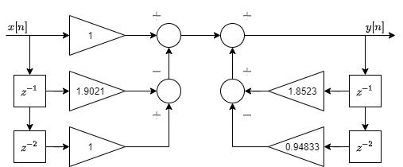

---
title: "Lista do Módulo 8"
author: "Levy Gabriel da Silva Galvão"
output: 
  html_document:
    highlight: tango
    includes:
      after_body: psbfix.html
---

# Módulo 8
## Exercício 1

> Dado a frequência f=0.3rad/s, calcule os valores de frequência em ciclos/s, rad/amostra e ciclos/amostra. Assuma o valor de fs=200 Hz.

```{r}
fs <- 200 # Hz
dt <- 1/fs # s
f_rad_s <- 0.3 # rad/s

# 2pi rad = 1 cycle
# dt s = 1 sample

f_cyc_s <- f_rad_s * (1/(2*pi)) # cycles/s = Hz
f_cyc_sample <- f_cyc_s * (2/fs) # cycles/sample  
f_rad_sample <- f_cyc_sample * pi # rad/sample

  
cat(' rad/s:',f_rad_s,'\n','cycles/s:',f_cyc_s,'\n','rad/sample:',f_rad_sample,'\n','cycles/sample:',f_cyc_sample)
```

## Exercício 2

> Gere 5 segundos de um sinal s, que deve ser a soma de dois sinais senoidais, sendo um oscilando a 60 ciclos/s e o outro a 100 ciclos por segundo. Adote a frequência de amostragem de 1,2 kHZ. Aplique a equação recursiva ao sinal s e responda às questões abaixo:

$y[n]=1.8523y[n−1]−0.94833y[n−2]+x[n]−1.9021x[n−1]+x[n−2]$

a) Qual foi o principal efeito de se aplicar a equação de $y[n]$ sobre o sinal $s$?

b) Esboce o diagrama de blocos que ilustre o processador descrito por $y[n]$.

```{r}
fs <- 1.2e3 # Hz
dt <- 1/fs # s
t_end <- 5 # s
t <- seq(0,t_end-dt,dt)
n <- length(t)
f1 <- 60 # Hz
f2 <- 100 # Hz
s <- sin(2*pi*f1*t) + sin(2*pi*f2*t)

plot(t[1:300],s[1:300],'l') # signal sample

y <- rep(0,n)
for(i in c(1:(n-2))){y[i+2] <- 1.6523*y[i+1] - 0.94833*y[i] + s[i+2] - 1.9021*s[i+1] + s[i]}

plot(t[1:300],y[1:300],'l') # signal after operation
```

a) Aplicando-se a equação $y[n]$ ao sinal $s$ observa-se a eliminação (filtragem) de termos de baixa frequência (no caso $f_1=60$ Hz), restando apenas o termo de alta frequência ($f_2=100$ Hz). Isso implica que o sisetma constitui-se de um filtro passa alta.

b) O diagrama de blocos do processador descrito pode ser visto como na figura abaixo:

<center>  </center>

## Exercício 3

> Calcule a resposta ao impulso unitário, $h[n]$, para o processador: $y[n]=y[n−1]+1Lx[n]−x[n−L]$.

```{r}
L <- 2 # arbitrary value
n <- 1000 # arbitrary value
h <- rep(0,n) # impulse response
x <- rep(0,n)
x[1] <- 1 # impulse

for(i in c(1:(n-L))){h[i+L] <- h[i+L-1] + (1/L)*x[i+L] - x[i]}

plot(h) # impulse response for given processor  
```

A resposta ao impulso desse sistema é um degrau espelhado no eixo x, consequentemente apresentando valor $h[n]=-1, \; \forall \, n>0$, como também podendo ser reconhecido como um filtro de média móvel (desde que respeite um limite de suas amostras).

## Exercício 4

> Gere 5 segundos de um sinal senoidal amostra a 500 Hz, oscilando a 30 Hz, e adicione ruído gaussiano (com amplitude de no máximo 10% ao valor máximo do sinal senoida). Aplique o processador da questão 3 ao sinal resultante. Qual foi o efeito observado? Plote os gráficos do sinal origina, corrompido e processado.

```{r}
t_end <- 5 # s
fs <- 500 # Hz
dt <- 1/fs # s
f <- 30 # Hz
t <- seq(0,t_end-dt,dt)
n <- length(t)
m <- 400 # max printed samples
signal <- sin(2*pi*f*t)

plot(t[1:m],signal[1:m],'l',main='Signal') # signal

norm_dist <- function(length_, min_, max_){return(qnorm(runif(length_,min=pnorm(min_),max=pnorm(max_))))}
max_ <- max(signal)
std_noise <- 0.1*max_
noise <- norm_dist(n, -std_noise, std_noise)

plot(t[1:m],noise[1:m],'l',main='Noise') # noise

noisy_signal <- signal+noise 

plot(t[1:m],noisy_signal[1:m],'l',main='Noisy signal') # noisy signal

L <- 2
processed <- rep(0,n) 
for(i in c(1:(n-L))){processed[i+L] <- processed[i+L-1] + (1/L)*noisy_signal[i+L] - noisy_signal[i]}

plot(t[1:m],processed[1:m],'l',main='Processed signal')
```

Ao aplicar o processador do quesito anterior ao sinal ruido deste quesito, observa-se uma clara filtragem do ruído, permitindo que se recupere as características do sinal original. Porém devido à distorção da forma de onda, a filtragem não foi totalmente capaz de recuperar o sinal em sua totalidade, ainda permanecendo um offset seguido de uma componenete de baixa frequência modulando o sinal.

## Exercício 5

> Calcule a resposta em frequência, $H(z)$ de $y[n]=0.5[x(n)+x[n−1]]$. Faça o gráfico da amplitude e fase. Que tipo de processador é esse?

Faz-se: $Y(z) = 0.5(X(z)+z^{-1}X(z)) = (0.5+0.5z^{-1}) X(z)$. Consequentemente: $H(z) = \frac{Y(z)}{X(z)} = 0.5 + 0.5 z^{-1} = \frac{b}{a}$.

A frequência de amostragem de 500 Hz será mantida do quesito anterior.

```{r}
library(signal)
library(ggplot2)
library(REdaS)

fs <- 500 # Hz
b <- c(0.5,0.5)
a <- c(1)

fres <- freqz(b, a, Fs=fs) # freq. response

angle_degree <-  rad2deg(atan2(Im(fres$h), Re(fres$h))) # phase response in degrees
amplitude_db <- 20 * log10(abs(fres$h)) # absolute freq. resposne in dB

df <- data.frame(freq=fres$f, angle_degree, amplitude_db)

ggplot(data=df, aes(x=freq, y=angle_degree)) + geom_line() + theme_classic() # phase response
ggplot(data=df, aes(x=freq, y=amplitude_db)) + geom_line() + theme_classic() # amplitude response
```

Este processador é um filtro de média móvel que pode ser usado para a filtragem de ruído de alta frequência devido ao seu comportamento de passa baixas.

## Exercício 6

> Simule três bursts de sinais eletromiográficos em um tempo de 10 s. Cada burst deve ter a duração de 2 segundos. Assuma que o sinal foi amostrado a 1000 Hz. Promova um ganho de 1.2 vezes nos trecho em que há atividade eletromiográfica. Filtre o sinal gerado com um fitro passa-baixa, com frequência de corte de 5 Hz e ordem 3. Faça a comparação entre sinais filtrados pelos filtros Butterworth e Chebyshev. Plote os gráficos dos sinais obtidados e as respostas em frequência dos filtros utilizados. Dicas: (i) para a geração do sinal utilize a função randn. (ii) Para a filtragem do sinal utilize a função filtfilt.

Inicialmente o sinal EMG é gerado:

```{r}
library(biosignalEMG)
library(dygraphs)
fs <- 1000 # Hz
dt <- 1/fs # s
t_end <- 10 # s
t <- seq(from=0, to=t_end-dt, by=dt)
n = length(t)
n_bursts <- 3 
dur_bursts <- 2000 # ms

emg <- syntheticemg(n.length.out=n, samplingrate=fs,
                    on.sd=0.5, on.duration.mean=dur_bursts, on.duration.sd=10,
                    off.sd=0.01, off.duration.mean=(n-n_bursts*dur_bursts)/n_bursts, off.duration.sd=10,
                    on.mode.pos=0.010, shape.factor=0.010)$values
plot(t,emg,'l',main='EMG signal')
```

Em seguida a atividade miográfica é detectada por meio do processamento realizado no módulo anterior por meio da detecção do limiar do valor RMS de uma certa janela do sinal, permitindo obter uma máscara binária que informa a atividade miográfica:

```{r}
# detectiong miographic activity by RMS threshold
n <- length(emg)
win.dur <- 100/1000 # window dur. (s)
win.size <- win.dur * fs # window dur. (samples)
win.overlap_per <- 0.1 # window ovelarp (percentage)
win.overlap <- win.overlap_per*win.size # window overlap (samples)
win.number <- round(n/win.size/win.overlap_per) # number of windows
win.idx_ini <- seq(from=1,to=n, by=win.size-win.overlap)
win.idx_end <- win.idx_ini+(win.size-1)
win.idx_end[win.idx_end>n] = n

rms <- function(x){return(sqrt(mean(x^2)))}
bursts_ <- rep(FALSE, n)
rms_ <- rep(0,n)
threshold <- 0.1
for(i in c(1:length(win.idx_ini)))
{
  win_rms <- rms(emg[win.idx_ini[i]:win.idx_end[i]])
  bursts_[win.idx_ini[i]:win.idx_end[i]] <- win_rms>threshold
  rms_[win.idx_ini[i]:win.idx_end[i]] <- win_rms
}

data.frame(t=t, emg=emg, rms=rms_, burst_mask=bursts_) %>% 
  dygraph(main='Synthetized EMG') %>%
  dyAxis('y', label='Amplitude') %>%
  dyAxis('x', label='Time (s)') %>%
  dyOptions(axisLineWidth=0.1, fillGraph=FALSE, drawGrid=FALSE)
```

Uma vez que foram detectados os trechos em que há atividade eletromiográfica, aplica-se um gganho de 1.2 nesse trecho:

```{r}
gain <- 1.2
amp_emg <- emg
amp_emg[bursts_] <- gain*emg[bursts_]
plot(t,amp_emg,'l',main='Amplified EMG signal')
```

Em seguida esse sinal resultado será filtrado pelo filtro passa-baixa com frequência de corte de 5 Hz e ordem 3 do tipo Butterworth e Chebyshev para termos de comparação:

```{r}
fs <- 100 # Hz (just remebering)
fc <- 5 # cutoff frequency (Hz)
fOrder <- 3 # filter order
Rp <- 0.5

# Butterworth filter
bt <- butter(fOrder, fc/(fs/2), type="low") # low-pass Butterworth filter
btr <- freqz(filt=bt, Fs=fs)

# Chebyshev filter
cb <- cheby1(fOrder, Rp, fc/(fs/2), type="low") # low-pass Butterworth filter
cbr <- freqz(filt=cb, Fs=fs)

# Comparison between filters
plot(btr$f/pi, 20 * log10(abs(btr$h)), type = "l", ylim = c(-100, 0),
xlim = c(0, 3*fc), xlab = "Frequency", ylab = c("dB"), main='Butterworth vs. Chebyshev filter')
lines(cbr$f/pi, 20 * log10(abs(cbr$h)), col = "red")
```

Por fim é realiza a filtragem do sinal por cada um dos filtros e realizada a comparação entre cada alternativa:

```{r}
emg_butterworth <- filtfilt(filt=bt, amp_emg) # Butterworth filtering
emg_chebyshev <- filtfilt(filt=cb, amp_emg) # Chebyshev filtering

# comparison
data.frame(time=t, emg_original=amp_emg, emg_butterworth, emg_chebyshev) %>%
  dygraph(main='EMG low-pass filtering comparison') %>%
  dyAxis('y', label='Amplitude') %>%
  dyAxis('x', label='Time (s)') %>%
  dyOptions(axisLineWidth=0.1, fillGraph=FALSE, drawGrid=FALSE)

```

Observa-se claramente a suavização dos sinais de saída dos filtros. Devido à leve diferença na resposta dos dois filtros utilizados, torna-se quase impossível de detectar maiores diferenças entre os efeitos do filtro de Butterworth para o de Chebyshev. A única diferença visual nas respostas dos filtros é que o de Butterworth é mais seletivo para ordem selecionada, permitindo que fortes atenuações ocorram próximas à frequência de corte, se comparado com o de Chebyshev.